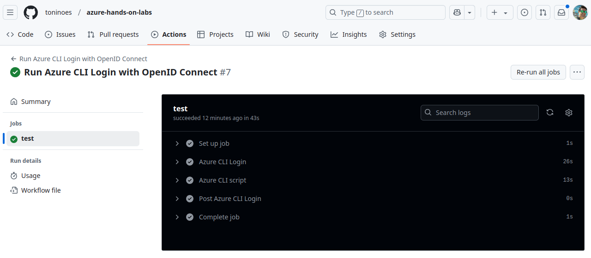

# Configure a federated identity credential

GitHub's OIDC provider works with Azure's workload identity federation. For an overview, see Microsoft's documentation at 
[Workload identity federation](https://docs.microsoft.com/en-us/azure/active-directory/develop/workload-identity-federation).

To configure the OIDC identity provider in Azure, you will need to perform the following configuration. For instructions 
on making these changes, refer to the [Azure documentation](https://docs.microsoft.com/en-us/azure/developer/github/connect-from-azure).

Overview of GitHub using Open ID Connect to authenticate to Azure:


Using my modulodromo repo.

## Run the lab

First you will need a [GitHub Personal Access Token](https://github.com/settings/personal-access-tokens):
```bash
export TF_VAR_github_token="github_pat_here"
```

...and then:
```bash
export ARM_SUBSCRIPTION_ID=$(az login --username 'USERNAME' --password 'PASSWORD' | jq -r '.[0].id') && export TF_VAR_resource_group_name='RG_NAME'
TF_WORKSPACE=sandbox terraform init
TF_WORKSPACE=sandbox terraform apply -var-file=sandbox.tfvars
```

Testing OIDC. Create a workflow under .github/workflows directory of your repo:
```yml
name: Run Azure CLI Login with OpenID Connect
on: [push, workflow_dispatch]

permissions:
  id-token: write # Require write permission to Fetch an OIDC token.

jobs:
  test:
    runs-on: ubuntu-latest
    environment: sandbox
    steps:
    - name: Azure CLI Login
      uses: azure/login@v2
      with:
        client-id: ${{ secrets.AZURE_CLIENT_ID }}
        tenant-id: ${{ secrets.AZURE_TENANT_ID }}
        subscription-id: ${{ secrets.AZURE_SUBSCRIPTION_ID }}

    - name: Azure CLI script
      uses: azure/cli@v2
      with:
        azcliversion: latest
        inlineScript: |
          az account show
          # You can write your Azure CLI inline scripts here.
```

we can run our workflows perfectly:
