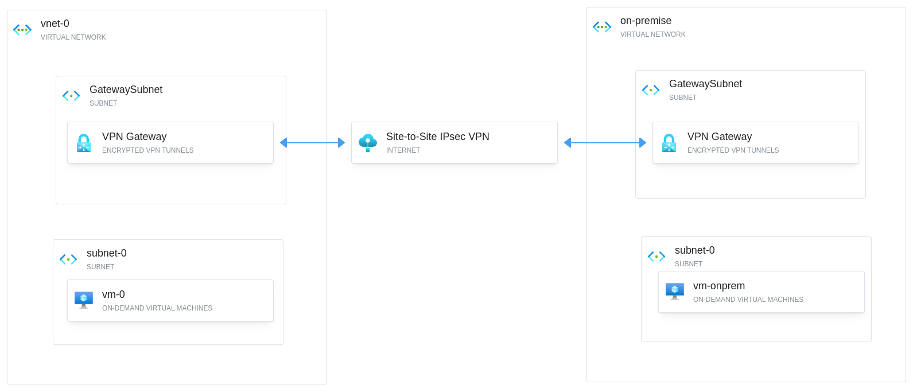

# Creating Site-to-Site IPsec VPN connection
In this Project, we'll create a Site-to-Site IPsec VPN connection in Azure, simulating a secure connection between an on-premises 
network and an Azure virtual network. This setup is commonly used by organizations to extend their on-premises network into 
the Microsoft Azure cloud, allowing resources in both networks to communicate securely over the internet. 



## What is a Site-to-Site VPN? 

A Site-to-Site VPN (Virtual Private Network) is a connection that allows us to securely link two networks over the internet. 
It extends our on-premises network into the cloud, making resources in both networks appear as if they're on the same local 
network.

## What is IPsec?
IPsec (Internet Protocol Security) is a protocol suite used to secure internet communications. It works by encrypting each 
IP packet in a data stream, providing confidentiality, integrity, and authentication of data communications over IP networks. 

## What is Azure VPN Gateway?
Azure VPN Gateway is a service that allows us to create encrypted connections between our Azure virtual networks and on-premises 
networks or other virtual networks in Azure. It acts as a virtual network gateway to send encrypted traffic between networks.

## Run the lab

```bash
export ARM_SUBSCRIPTION_ID=$(az login --username 'USERNAME' --password 'PASSWORD' | jq -r '.[0].id') && export TF_VAR_resource_group_name='RG_NAME'
TF_WORKSPACE=sandbox terraform init
TF_WORKSPACE=sandbox terraform apply -var-file=sandbox.tfvars
```

After apply, you will obtain the following outputs to test connectivity:
```bash
Outputs:

vm_0_access = "ssh -i toninoes-vnet-0.pem toninoes@13.95.131.24"
vm_0_testing_connection_to_vm_on_prem = "ping 10.1.0.4"
vm_onprem_access = "ssh -i toninoes-onprem.pem toninoes@13.95.111.121"
vm_onprem_testing_connection_to_vm_0 = "ping 10.0.0.4"
```

## Testing the lab
SSH into VM-0 and ping to VM-OnPrem

```bash
➜  creating-site-to-site-IPsec-VPN git:(main) ✗ ssh -i toninoes-vnet-0.pem toninoes@13.95.131.24
The authenticity of host '13.95.131.24 (13.95.131.24)' can't be established.
ED25519 key fingerprint is SHA256:7D/gvJ63lWDpOaRFJZG84ulGP07C1mnzHMLQrNKBRVQ.
This key is not known by any other names.
Are you sure you want to continue connecting (yes/no/[fingerprint])? yes
...
...
...
toninoes@vm-0:~$ ping 10.1.0.4
PING 10.1.0.4 (10.1.0.4) 56(84) bytes of data.
64 bytes from 10.1.0.4: icmp_seq=1 ttl=64 time=4.22 ms
64 bytes from 10.1.0.4: icmp_seq=2 ttl=64 time=5.12 ms
64 bytes from 10.1.0.4: icmp_seq=3 ttl=64 time=3.43 ms
^C
--- 10.1.0.4 ping statistics ---
3 packets transmitted, 3 received, 0% packet loss, time 2003ms
rtt min/avg/max/mdev = 3.428/4.256/5.116/0.689 ms
toninoes@vm-0:~$ exit
logout
Connection to 13.95.131.24 closed.
```
and reverse...

```bash
➜  creating-site-to-site-IPsec-VPN git:(main) ✗ ssh -i toninoes-onprem.pem toninoes@13.95.111.121
The authenticity of host '13.95.111.121 (13.95.111.121)' can't be established.
ED25519 key fingerprint is SHA256:yFXUAb8rlkz0sVTjnlRD1cdO/Jy+YfmOK+ZN0XadRbY.
This key is not known by any other names.
Are you sure you want to continue connecting (yes/no/[fingerprint])? yes
...
...
...
toninoes@vm-onprem:~$ ping 10.0.0.4
PING 10.0.0.4 (10.0.0.4) 56(84) bytes of data.
64 bytes from 10.0.0.4: icmp_seq=1 ttl=64 time=3.65 ms
64 bytes from 10.0.0.4: icmp_seq=2 ttl=64 time=5.54 ms
64 bytes from 10.0.0.4: icmp_seq=3 ttl=64 time=3.12 ms
^C
--- 10.0.0.4 ping statistics ---
3 packets transmitted, 3 received, 0% packet loss, time 2003ms
rtt min/avg/max/mdev = 3.117/4.101/5.536/1.037 ms
toninoes@vm-onprem:~$ exit
logout
Connection to 13.95.111.121 closed.
```
## Requirements

| Name | Version |
|------|---------|
| terraform | ~> 1.0 |
| azurerm | ~> 4.0 |

## Providers

| Name | Version |
|------|---------|
| azurerm | 4.17.0 |

## Modules

| Name | Source | Version |
|------|--------|---------|
| onprem | git::git@github.com:toninoes/modulodromo.git//azure/virtual_network | n/a |
| vm\_0 | git::git@github.com:toninoes/modulodromo.git//azure/virtual_machine | n/a |
| vm\_onprem | git::git@github.com:toninoes/modulodromo.git//azure/virtual_machine | n/a |
| vnet\_0 | git::git@github.com:toninoes/modulodromo.git//azure/virtual_network | n/a |

## Resources

| Name | Type |
|------|------|
| [azurerm_local_network_gateway.onprem](https://registry.terraform.io/providers/hashicorp/azurerm/latest/docs/resources/local_network_gateway) | resource |
| [azurerm_local_network_gateway.vnet_0](https://registry.terraform.io/providers/hashicorp/azurerm/latest/docs/resources/local_network_gateway) | resource |
| [azurerm_virtual_network_gateway_connection.vpn_tunnel_onprem_to_vnet_0_](https://registry.terraform.io/providers/hashicorp/azurerm/latest/docs/resources/virtual_network_gateway_connection) | resource |
| [azurerm_virtual_network_gateway_connection.vpn_tunnel_vnet_0_to_onprem](https://registry.terraform.io/providers/hashicorp/azurerm/latest/docs/resources/virtual_network_gateway_connection) | resource |
| [azurerm_resource_group.this](https://registry.terraform.io/providers/hashicorp/azurerm/latest/docs/data-sources/resource_group) | data source |

## Inputs

| Name | Description | Type | Default | Required |
|------|-------------|------|---------|:--------:|
| admin\_username | The username of the local administrator used for the Virtual Machine. Changing this forces a new resource to be created. | `string` | `"toninoes"` | no |
| resource\_group\_name | Resource group where to deploy. | `string` | n/a | yes |
| ssh\_key\_pairs\_name | Name used to create SSH key pairs. | `string` | `"toninoes"` | no |

## Outputs

| Name | Description |
|------|-------------|
| vm\_0\_access | SSH command to access to VM-0 |
| vm\_0\_testing\_connection\_to\_vm\_on\_prem | PING command to test connectivity through Site-to-Site IPsec VPN connection to VM-onprem |
| vm\_onprem\_access | SSH command to access to VM-Onprem |
| vm\_onprem\_testing\_connection\_to\_vm\_0 | PING command to test connectivity through Site-to-Site IPsec VPN connection to VM-0 |
