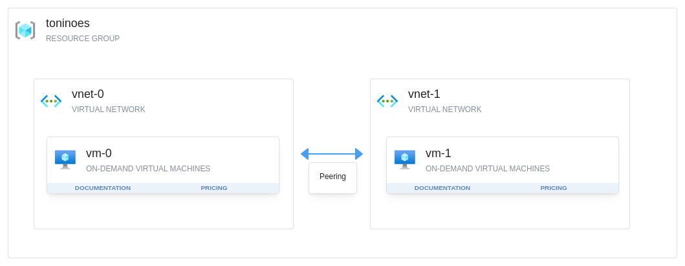

# Implementing Virtual Network Peering
In this lab we will walk through the steps to create two peered Virtual Networks, launching a VM in both Virtual Networks 
and establishing a communication between both the VMs.



## What is VNet Peering in Azure?

* Azure VNet peering is a feature that allows for direct communication between two Azure Virtual Networks (VNets) in the 
same Azure region.
* VNet peering creates a high-speed, low-latency connection between the peered VNets, allowing resources in one VNet to 
communicate with resources in another VNet as if they were in the same network.
* VNet peering can be used to connect VNets within the same Azure subscription or across different subscriptions.
* VNet peering supports both IPv4 and IPv6 addresses, and also allows for transitive routing, meaning that resources in 
one VNet can communicate with resources in another VNet that is peered with the first VNet.
* VNet peering can be used to create a hub-and-spoke network topology, where a central hub VNet has peered with multiple 
spoke VNets.

## Run the lab

```bash
export ARM_SUBSCRIPTION_ID=$(az login --username 'USERNAME' --password 'PASSWORD' | jq -r '.[0].id') && export TF_VAR_resource_group_name='RG_NAME'
TF_WORKSPACE=sandbox terraform init
TF_WORKSPACE=sandbox terraform apply -var-file=sandbox.tfvars
```

After apply, you will obtain the following outputs to test connectivity:
```bash
Apply complete! Resources: 11 added, 0 changed, 0 destroyed.

Outputs:

my_public_ip = "213.94.5.234"
vm_0_access = "ssh -i toninoes.pem toninoes@172.211.22.172"
vm_0_testing_connection_to_vm_1 = "ping 10.1.0.4"
vm_1_access = "ssh -i toninoes.pem toninoes@172.211.22.219"
vm_1_testing_connection_to_vm_0 = "ping 10.0.0.4"
```

## Testing the lab
SSH into VM-0 and ping to VM-1

```bash
➜  implementing-virtual-network-peering git:(main) ✗ ssh -i toninoes.pem toninoes@172.211.22.172
The authenticity of host '172.211.22.172 (172.211.22.172)' can't be established.
ED25519 key fingerprint is SHA256:JrEERJP31KkVfwn7jmx5TFqZwqThrEo6a3vW9/60XGY.
This key is not known by any other names.
Are you sure you want to continue connecting (yes/no/[fingerprint])? yes
...
...
toninoes@vm-0:~$ ping 10.1.0.4
PING 10.1.0.4 (10.1.0.4) 56(84) bytes of data.
64 bytes from 10.1.0.4: icmp_seq=1 ttl=64 time=11.8 ms
64 bytes from 10.1.0.4: icmp_seq=2 ttl=64 time=5.83 ms
64 bytes from 10.1.0.4: icmp_seq=3 ttl=64 time=4.33 ms
^C
--- 10.1.0.4 ping statistics ---
3 packets transmitted, 3 received, 0% packet loss, time 2004ms
rtt min/avg/max/mdev = 4.325/7.304/11.756/3.207 ms
toninoes@vm-0:~$ exit
logout
Connection to 172.211.22.172 closed.
```
and reverse...

```bash
➜  implementing-virtual-network-peering git:(main) ✗ ssh -i toninoes.pem toninoes@172.211.22.219
The authenticity of host '172.211.22.219 (172.211.22.219)' can't be established.
ED25519 key fingerprint is SHA256:gFJBh0HtwfMfH9pEuHrCRkoQBj8PBHazRXW8RCfDMPs.
This key is not known by any other names.
Are you sure you want to continue connecting (yes/no/[fingerprint])? yes
Warning: Permanently added '172.211.22.219' (ED25519) to the list of known hosts.
Welcome to Ubuntu 22.04.5 LTS (GNU/Linux 6.5.0-1025-azure x86_64)
...
...
toninoes@vm-1:~$ ping 10.0.0.4
PING 10.0.0.4 (10.0.0.4) 56(84) bytes of data.
64 bytes from 10.0.0.4: icmp_seq=1 ttl=64 time=8.98 ms
64 bytes from 10.0.0.4: icmp_seq=2 ttl=64 time=7.96 ms
64 bytes from 10.0.0.4: icmp_seq=3 ttl=64 time=1.33 ms
^C
--- 10.0.0.4 ping statistics ---
3 packets transmitted, 3 received, 0% packet loss, time 2002ms
rtt min/avg/max/mdev = 1.331/6.090/8.983/3.391 ms
toninoes@vm-1:~$ exit
logout
Connection to 172.211.22.219 closed.
```
## Requirements

| Name | Version |
|------|---------|
| terraform | ~> 1.0 |
| azurerm | ~> 4.0 |
| external | ~> 2.0 |
| local | ~> 2.0 |
| tls | ~> 4.0 |

## Providers

| Name | Version |
|------|---------|
| azurerm | 4.16.0 |
| external | 2.3.4 |

## Modules

| Name | Source | Version |
|------|--------|---------|
| vm\_0 | git::git@github.com:toninoes/modulodromo.git//azure/virtual_machine | n/a |
| vm\_1 | git::git@github.com:toninoes/modulodromo.git//azure/virtual_machine | n/a |
| vnet\_0 | git::git@github.com:toninoes/modulodromo.git//azure/virtual_network | n/a |
| vnet\_1 | git::git@github.com:toninoes/modulodromo.git//azure/virtual_network | n/a |

## Resources

| Name | Type |
|------|------|
| [azurerm_virtual_network_peering.vnet_0_to_vnet_1](https://registry.terraform.io/providers/hashicorp/azurerm/latest/docs/resources/virtual_network_peering) | resource |
| [azurerm_virtual_network_peering.vnet_1_to_vnet_0](https://registry.terraform.io/providers/hashicorp/azurerm/latest/docs/resources/virtual_network_peering) | resource |
| [external_external.myipaddr](https://registry.terraform.io/providers/hashicorp/external/latest/docs/data-sources/external) | data source |

## Inputs

| Name | Description | Type | Default | Required |
|------|-------------|------|---------|:--------:|
| admin\_username | The username of the local administrator used for the Virtual Machine. Changing this forces a new resource to be created. | `string` | `"toninoes"` | no |
| resource\_group\_name | Resource group where to deploy. | `string` | n/a | yes |
| ssh\_key\_pairs\_name | Name used to create SSH key pairs. | `string` | `"toninoes"` | no |

## Outputs

| Name | Description |
|------|-------------|
| my\_public\_ip | My public IP. Only to test that NSG are properly defined. |
| vm\_0\_access | SSH command to access to VM-0 |
| vm\_0\_testing\_connection\_to\_vm\_1 | PING command to test connectivity through peer connection to VM-1 |
| vm\_1\_access | SSH command to access to VM-1 |
| vm\_1\_testing\_connection\_to\_vm\_0 | PING command to test connectivity through peer connection to VM-0 |

